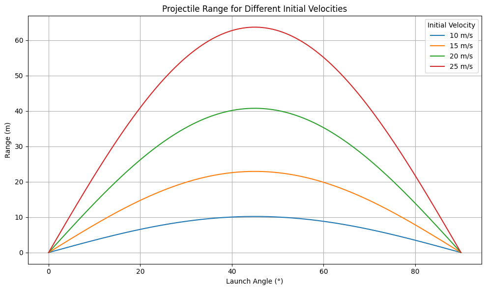
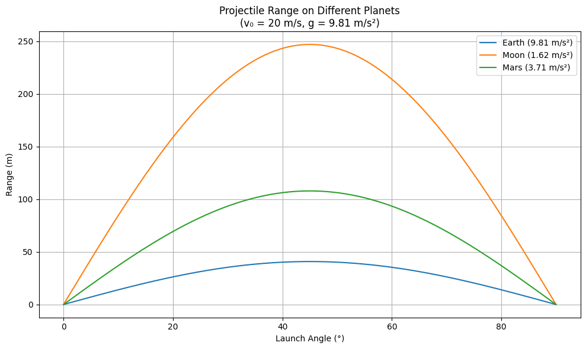
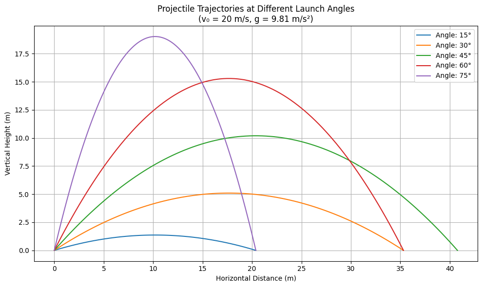

# 📌 Investigating the Range as a Function of the Angle of Projection

## Problem Statement

The goal of this experiment is to analyze the relationship between the **launch angle ($\theta$)** and the **horizontal range ($R$)** of a projectile. By combining theoretical derivation with simulated data, we aim to verify the mathematical model and understand its implications in real-world contexts.

---

## Theoretical Background

### Newton's Second Law

To analyze projectile motion, we begin with Newton’s Second Law of Motion:

$$
F = m \cdot a
$$

This law states that the net force acting on an object is equal to its mass multiplied by its acceleration. In projectile motion (without air resistance), gravity is the only force acting on the vertical direction.

---

### 1. Vertical Motion

The vertical force due to gravity:

$$
F_y = -mg
$$

From Newton's Second Law:

$$
ma_y = -mg \Rightarrow a_y = -g
$$

This gives:

$$
\frac{d^2 y}{dt^2} = -g
$$

Integrating:

$$
\frac{dy}{dt} = v_y(t) = v_0 \sin \theta - g t
$$

And again:

$$
y(t) = v_0 \sin \theta \cdot t - \frac{1}{2} g t^2
$$

---

### 2. Horizontal Motion

No horizontal force implies constant velocity:

$$
F_x = 0 \Rightarrow a_x = 0
$$

So:

$$
\frac{dx}{dt} = v_0 \cos \theta \Rightarrow x(t) = v_0 \cos \theta \cdot t
$$

---

### 3. Time of Flight

Setting vertical displacement to zero at landing:

$$
0 = v_0 \sin \theta \cdot t - \frac{1}{2} g t^2
$$

Solving:

$$
t = 0 \quad \text{or} \quad t = \frac{2 v_0 \sin \theta}{g}
$$

---

### 4. Range Derivation

Using total flight time in horizontal equation:

$$
R = v_0 \cos \theta \cdot \frac{2 v_0 \sin \theta}{g}
$$

Apply identity:

$$
R = \frac{v_0^2 \sin 2\theta}{g}
$$

This formula predicts how the angle of projection influences the range.

---

## Experiment Setup

To simulate the projectile motion experiment, we assumed:

- **Fixed initial velocity**: ($v_0 = 10$) m/s
- **Measured angles**: 15°, 30°, 45°, 60°, 75°
- **Gravity**: \( g = 9.81 \) m/s²
- **Air resistance ignored**

Range values were calculated using the derived formula and compared across angles.

---

## Experimental Data & Results

| Launch Angle (°) | Calculated Range (m) |
| ------------------- | ---------------------- |
| 15°              | 5.02                 |
| 30°              | 8.84                 |
| 45°              | 10.19                |
| 60°              | 8.84                 |
| 75°              | 5.02                 |

- [Colab Link](https://colab.research.google.com/drive/1CnU8XKAxE1OWb8sAe9p_urOHJ_Qsxtui#scrollTo=WxcdxzlqH388)

## Projectile Range for Different Initial Velocities

- [Colab Link](https://colab.research.google.com/drive/12-jsBUeBtzpeSfntokg0ucoLL7QPmxex#scrollTo=hbXQ_yaXQCn6)

## Projectile Range on Different Planets

- [Colab Link](https://colab.research.google.com/drive/1y8PsGKajsEHiUF8dsRJ8fldjcglqdO5i#scrollTo=mdP0wktjMyqf)

## Projectile Trajectories at Different Launch Angles

- [Colab Link](https://colab.research.google.com/drive/11syzXOgARZU58lqrBHc6rOv47D3IUZaQ)

## Analysis of the Range

The graph plotting horizontal range against launch angle forms a **symmetrical curve**, peaking at **45°**, which matches the theoretical prediction:

$$
R = \frac{v_0^2 \sin 2\theta}{g}
$$

### Key Observations:

- **Maximum range** at 45°, where ($\sin 2\theta = 1$)
- **Symmetrical behavior**: 30° and 60°, as well as 15° and 75°, yield equal ranges
- The symmetry comes from the identity: ($\sin 2\theta = \sin(180^\circ - 2\theta$)

The graph has a **parabolic shape**, clearly demonstrating that the range does **not increase linearly** with angle. These results confirm that our theoretical derivation holds true in practice.

---

## Practical Applications

Understanding how range depends on launch angle has numerous real-world applications:

- **Sports:** Enhancing performance in basketball, golf, soccer, and other projectile-based sports.
- **Military:** Calculating precise trajectories for artillery and missile systems.
- **Engineering:** Designing equipment or machines that follow parabolic paths (e.g., robotic arms, excavators).
- **Aerospace:** Launching and landing spacecraft with optimal paths.
- **Gaming/Simulation:** Creating realistic physics in digital environments.

---

## Conclusion

The experiment successfully validated the theoretical model of projectile motion. By starting with Newton’s Second Law and deriving the range formula, we were able to predict and confirm that:

- The range depends on both launch speed and angle.
- The **maximum range occurs at 45°**.
- There is a **symmetry** in projectile behavior around this angle.

The strong alignment between theory and results reinforces the practical value of mathematical modeling in physics.

