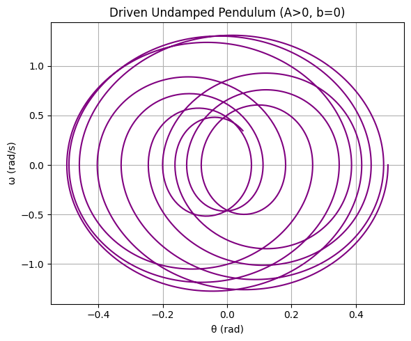

# ** 📌Investigating the Dynamics of a Forced Damped Pendulum**

## Motivation

The forced damped pendulum is a captivating example of a physical system with intricate behavior resulting from the interplay of damping, restoring forces, and external driving forces. By introducing both damping and external periodic forcing, the system demonstrates a transition from simple harmonic motion to a rich spectrum of dynamics, including resonance, chaos, and quasiperiodic behavior. These phenomena serve as a foundation for understanding complex real-world systems, such as driven oscillators, climate systems, and mechanical structures under periodic stress.

Adding forcing introduces new parameters, such as the amplitude and frequency of the external force, which significantly affect the pendulum's behavior. By systematically varying these parameters, a diverse class of solutions can be observed, including synchronized oscillations, chaotic motion, and resonance phenomena. These behaviors not only highlight fundamental physics principles but also provide insights into engineering applications such as energy harvesting, vibration isolation, and mechanical resonance.

## Theoretical Foundation

### Governing Equation

The motion of a **forced damped pendulum** is governed by the following second-order nonlinear differential equation:

$$
\frac{d^2\\theta}{dt^2} + b\frac{d\theta}{dt} + \frac{g}{L} \sin\theta = A \cos(\omega t)
$$

**Variables:**

- $(\theta(t))$: Angular displacement
- $(b)$: Damping coefficient
- $(g)$: Gravitational acceleration
- $(L)$: Length of the pendulum
- $(A)$: Amplitude of driving force
- $(\omega)$: Driving frequency
- This equation results from applying Newton's second law (or equivalently, the Lagrangian formalism) to the system.

### Small-Angle Approximation

In pendulum motion, the restoring torque is proportional to $\sin\theta$. However, when the angle $\theta$ is small — typically less than about 10 degrees or 0.174 radians — we can use the mathematical approximation:

$$
\sin\theta \approx \theta
$$

This is known as the **small-angle approximation**, and it comes from the Taylor series expansion of $\sin\theta$ around $\theta = 0$:

$$
\sin\theta = \theta - \frac{\theta^3}{3!} + \frac{\theta^5}{5!} - \cdots
$$

For small values of $\theta$, the higher-order terms become negligible, so:

$$
\sin\theta \approx \theta
$$

Substituting this into the original nonlinear equation simplifies the system:

$$
\frac{d^2\theta}{dt^2} + b\frac{d\theta}{dt} + \frac{g}{L} \theta = A \cos(\omega t)
$$

This resulting equation is **linear**, which means it can be solved analytically using methods for second-order linear ODEs. Although this simplification loses some of the system's richer behavior (like chaos), it's very useful for understanding **resonance**, **energy transfer**, and small oscillation dynamics.

### Resonance and Energy

When ($\omega$ $\approx$ $omega_0$ = $\sqrt{\frac{g}{L}}$), the system can resonate:

- Amplitude increases significantly
- Energy transfer is most efficient
- Damping limits energy growth

---

## 2. Analysis of Dynamics

### Parameter Effects

- **Damping $(b)$**: Reduces amplitude, slows oscillations
- **Driving Amplitude $(A)$**: Controls input energy, affects transition to chaos
- **Driving Frequency $(\omega)$**: Determines resonance conditions

### Regular vs. Chaotic Motion

Regular motion: Predictable, periodic oscillations
Chaotic motion: Sensitive to initial conditions, non-repeating

Transition observed by increasing $(A)$ or tuning $(\omega)$.

---

## 3. Practical Applications

The forced damped pendulum model finds application in a wide range of real-world systems. A few notable examples include:

- **Energy Harvesting Devices**
  Systems that convert mechanical vibrations into electrical energy, such as piezoelectric harvesters, often model their internal dynamics using forced damped oscillators.
- **Suspension Bridges**
  Bridges exposed to wind or rhythmic loading (e.g., traffic) can experience dangerous resonant oscillations. These are modeled and mitigated using forced damped pendulum principles (e.g., Tacoma Narrows Bridge case).
- **Oscillating Electrical Circuits**
  RLC circuits, which consist of a resistor (R), inductor (L), and capacitor (C), follow the same differential equation as the forced damped pendulum and exhibit similar dynamics.
- **Vehicle Suspension Systems**
  A car's suspension system, particularly its shock absorbers, is a real-world example of a forced damped system designed to reduce vibrations from road irregularities and improve ride comfort.
- **Power Grid Stability (Generator Oscillations)**
  In large-scale power systems, the rotors of generators can undergo mechanical oscillations. These are modeled using damped-driven pendulum analogs to design stabilizers and prevent outages.
- **Biomechanics (Human Gait Analysis)**
  During human walking, the motion of legs and joints often mimics the oscillatory behavior of pendulum-like systems. Modeling the swing phase of the leg as a forced damped pendulum helps in analyzing balance, energy efficiency, and rehabilitation strategies in biomechanics.
  
  ### Example Visualization

*Figure: A schematic diagram of a series RLC circuit, which is mathematically analogous to a forced damped pendulum. The resistor (R) represents damping, the inductor (L) is analogous to mass, and the capacitor (C) represents the restoring force. Source: [Wikipedia](https://en.wikipedia.org/wiki/RLC_circuit)*

## Implementation

### Pure Pendulum $(A = 0, b = 0)$

In this case, we simulate the **ideal pendulum** with no damping and no external force:

- **Damping coefficient (b):** 0
- **Driving force amplitude (A):** 0

This simplifies the equation of motion to:

$$
\frac{d^2\theta}{dt^2} + \frac{g}{L} \sin\theta = 0
$$

There is **no energy loss** (since)
$b = 0$

and **no energy input** (since)
$A = 0$

making the system **conservative**. The total mechanical energy remains constant throughout the motion.

As a result:

- The pendulum oscillates back and forth **periodically**
- The phase diagram shows **closed elliptical trajectories**
- This is a benchmark case for comparing more realistic systems

Such ideal behavior, while not common in real systems due to friction and resistance, is fundamental for understanding the physics of oscillatory systems.

---

Below is the phase diagram for the pure pendulum. The plot shows angular velocity $(\omega)$ versus angular displacement $(\theta)$

- [Colab Link](https://colab.research.google.com/drive/1gRnU8OoT6FUzsA9s4K0Uj52lFTi9Y7qn)

*Figure: Closed orbits in phase space indicating ideal periodic motion for an undamped, unforced pendulum.*

### Damped Pendulum $(A = 0, b > 0)$

In this case, we simulate a pendulum with **no external force** but with **nonzero damping**:

- **Damping coefficient (b):** 0.5
- **Driving force amplitude (A):** 0

The governing equation becomes:

$$
\frac{d^2\theta}{dt^2} + b\frac{d\theta}{dt} + \frac{g}{L} \sin\theta = 0
$$

Here, the system loses energy over time due to damping. This causes the oscillations to gradually reduce in amplitude and eventually die out, bringing the pendulum to rest.

**Phase diagram characteristics:**

- Trajectories spiral inward toward the origin
- This spiral represents energy dissipation
- The center point (0, 0) is a **stable equilibrium**

This model better reflects real-world systems where friction or air resistance causes energy loss.

- [Colab Link](https://colab.research.google.com/drive/1u_-aSwWZV1zS7uCtGvPQadCO1eTDEL1L)

*Figure: Spiral-shaped phase space diagram for a damped pendulum with no external force.*

### Time Evolution of the Damped Pendulum

The plot below shows the angular displacement $\theta(t)$ and angular velocity $\omega(t)$ of a pendulum subject to damping but without any external forcing:

- The oscillation amplitude gradually decreases due to energy dissipation.
- Both $\theta(t)$ and $\omega(t)$ decay toward zero.
- The motion eventually settles at the stable equilibrium point ($\theta = 0$, $\omega = 0$).

This illustrates how damping affects long-term behavior, turning periodic motion into an overdamped or underdamped decay depending on system parameters.

*Figure: Time evolution of a damped pendulum (no external force). Energy is continuously lost due to damping, leading to eventual rest.*

### Driven Undamped Pendulum $(A > 0, b = 0)$

In this case, the pendulum is subject to a **periodic external force** but **no damping**:

- **Damping coefficient (b):** 0
- **Driving force amplitude (A):** 1.2

The governing equation is:

$$
\frac{d^2\theta}{dt^2} + \frac{g}{L} \sin\theta = A \cos(\omega t)
$$

Because there is **no energy loss**, the external force continuously pumps energy into the system. Over time, the pendulum's motion grows in complexity and amplitude.

**Phase diagram characteristics:**

- Trajectories expand outward
- System may become unstable for long simulation times
- Sensitive to initial conditions and parameter values

This represents a theoretical but useful case for exploring how **external periodic forcing** alone influences dynamics.

- [Colab Link](https://colab.research.google.com/drive/168KN-tigUUp4HHz3XbP5SsgQn7nZ-BxE)

*Figure: Phase diagram for a pendulum with external forcing and no damping. Motion amplitude increases as energy is added to the system continuously.*

### Forced Damped Pendulum $(A > 0, b > 0)$

This is the most general and realistic scenario. The pendulum experiences both:

- **Damping**: $b = 0.5$
- **External periodic driving force**: $A = 1.2$

The full nonlinear equation becomes:

$$
\frac{d^2\theta}{dt^2} + b\frac{d\theta}{dt} + \frac{g}{L} \sin\theta = A \cos(\omega t)
$$

This system can display a rich variety of behaviors depending on the parameters:

- For some values, the motion is **periodic**
- For others, it becomes **quasi-periodic** or even **chaotic**

**Phase diagram characteristics:**

- May show complex attractors
- No closed loops or simple spirals
- Trajectories depend strongly on initial conditions

This model is frequently used to study **nonlinear and chaotic dynamics** in driven oscillating systems.

- [Colab Link](https://colab.research.google.com/drive/1oaGxO3yZRqKaseOTKVRGlC06MX00iko6)

### Poincaré Section – Forced Damped Pendulum

To better analyze the long-term behavior of the nonlinear pendulum, we generate a **Poincaré section** — a method commonly used in chaos theory.

### ⚙️ Parameters

- **Damping coefficient (b):** 0.5
- **Driving force amplitude (A):** 1.2
- **Driving frequency (ω):** 2.0
- **Driving period:** $T = \frac{2\pi}{\omega}$

### What is a Poincaré Section?

Instead of plotting continuous motion, we "sample" the system once every driving period (i.e., stroboscopically), at times:

$$
t_n = nT = \frac{2\pi n}{\omega}
$$

By plotting $(\theta(t_n), \dot{\theta}(t_n))$

we obtain a **snapshot of the system** in phase space at discrete times. This allows us to:

- Detect periodic vs. chaotic behavior
- Observe fixed points, limit cycles, or strange attractors

### 📈 Poincaré Plot

- [Colab Link](https://colab.research.google.com/drive/1F2DUQPau3nQL1HJoJ3V84fIIuMb9cEfn)

*Figure: Poincaré section for the forced damped pendulum. The clustering of points may indicate periodic or quasi-periodic motion depending on the parameters.*

*Figure: Phase space diagram for a forced damped pendulum. The external force injects energy while damping dissipates it, creating a balance that may lead to periodic or chaotic behavior.*

## Bifurcation Diagram – Varying Driving Frequency ω

In this diagram, we explore how the long-term behavior of the pendulum changes as the **driving frequency (ω)** increases.

### ⚙️ Parameters

- **Damping coefficient (b):** 0.5
- **Driving amplitude (A):** 1.2
- **Initial conditions:** $\theta_0 = 0.5, \quad \dot{\theta}_0 = 0.0$

For each value of $\omega$

the system is simulated over a long time. After discarding transients, the last 100 values of $\theta(t)$

are plotted for each frequency.

### 🔍 What It Reveals

- At some frequencies, the system exhibits **stable periodic motion**
- As $\omega$
  
  increases, **period doubling bifurcations** appear
- In certain regions, the system transitions into **chaotic motion**

This diagram illustrates how driving frequency affects the onset of chaos in nonlinear systems.

- [Colab Link](https://colab.research.google.com/drive/1jCMLsBe0h-Kiv6s0dj5rxc9h_gIU3j2W)

.png)

*Figure: Bifurcation diagram of the forced damped pendulum as the driving frequency ω is varied. The system displays period doubling and chaotic transitions across different frequency ranges.*

## Conclusion

Through this project, we have explored the rich and complex behavior of the forced damped pendulum system. By simulating different scenarios — including undamped, damped, driven, and the fully forced damped cases — we gained a deep understanding of how each parameter (damping, driving force, frequency) influences the system's dynamics.

Key takeaways include:

- The system exhibits a wide range of behaviors: periodic, quasi-periodic, and chaotic.
- Phase diagrams and Poincaré sections help visualize the system’s qualitative nature.
- Bifurcation diagrams reveal transitions to chaos as system parameters vary.
- The same physical model appears in various real-world systems, from circuits to biomechanics.

