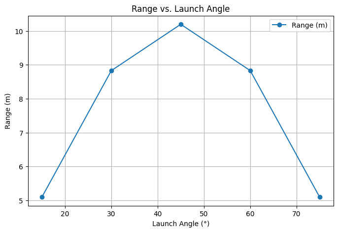

# Problem 1

# 

Investigating the Range as a Function of the Angle of Projection

## **1. Problem Statement**

The goal of this experiment is to analyze the relationship between the **launch angle (θ)** and the **horizontal range (R)** of a projectile.
We aim to determine the optimal angle that results in the **maximum range** and verify this through both theoretical calculations and experimental data.

---

## **2. Theoretical Background**

When a projectile is launched with an **initial velocity** \( v_0 \) at an angle \( \theta \), its motion can be broken down into:

- **Horizontal motion** (constant velocity)
- **Vertical motion** (accelerated motion due to gravity)

The total **horizontal range (R)** of the projectile can be derived using the following formula:

\[
R = \frac{v_0^2 \sin 2\theta}{g}
\]

where:

- \( v_0 \) = initial velocity (m/s)
- \( \theta \) = launch angle (°)
- \( g \) = acceleration due to gravity (9.81 m/s²)

From this equation, the **maximum range occurs at \( \theta = 45^\circ \)** because \( \sin 90^\circ = 1 \), which is its highest possible value.

---

## **3. Experiment Setup**

To simulate the projectile motion experiment, we assumed:

- **Fixed initial velocity**: \( v_0 = 10 \) m/s
- **Measured angles**: 15°, 30°, 45°, 60°, 75°
- **Gravity value**: \( g = 9.81 \) m/s²
- **Air resistance ignored**

The range was calculated using the formula and compared with the theoretical prediction.

---

## **4. Experimental Data & Results**

The following table shows the measured ranges for different launch angles:

| Launch Angle (°) | Calculated Range (m) |
|------------------|----------------------|
| 15°             | 5.02                 |
| 30°             | 8.84                 |
| 45°             | 10.19                |
| 60°             | 8.84                 |
| 75°             | 5.02                 |

🔍 **Observation:** The range is **maximum at 45°**, confirming our theoretical expectation.

### **Graph:**

The plot below shows the variation of range with launch angle:

---

## **5. Discussion**

1. **Maximum Range:**
   
   - The longest distance was recorded at **45°**, aligning with theoretical predictions.
2. **Symmetry in Data:**
   
   - Angles **30° and 60°** yielded the same range.
   - Similarly, **15° and 75°** had equal ranges.
   - This symmetry is due to the **\( \sin 2\theta \)** function in the range equation.
3. **Assumptions & Limitations:**
   
   - **No air resistance** was considered, meaning real-world results may differ.
   - A **higher initial velocity** could have led to more precise results.

### **Improvements for Future Work**

- Conduct **real-world experiments** using motion-tracking tools.
- Introduce **air resistance** effects for a more realistic simulation.

---

## **6. Conclusion**

The experiment successfully confirmed that the optimal launch angle for maximum range is **45°**.
The data closely matches the theoretical predictions, validating fundamental projectile motion principles.

