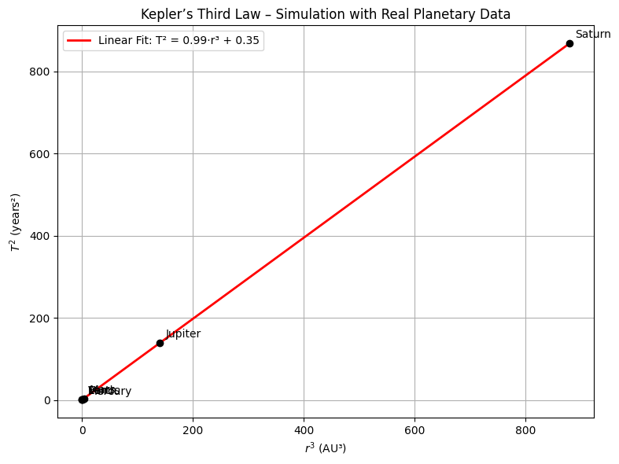

# 📌Orbital Period and Orbital Radius

## Motivation

The relationship between the square of the orbital period and the cube of the orbital radius, known as Kepler's Third Law, is a cornerstone of celestial mechanics. This simple yet profound relationship allows for the determination of planetary motions and has implications for understanding gravitational interactions on both local and cosmic scales. By analyzing this relationship, one can connect fundamental principles of gravity with real-world phenomena such as satellite orbits and planetary systems.

## Theoretical Foundation

To derive the relationship between the orbital period $T$ and the orbital radius $r$, we start by analyzing the forces acting on a satellite or planet moving in a circular orbit.

### Gravitational Force

According to Newton's Law of Universal Gravitation:

$$F = \frac{GMm}{r^2}$$

For circular motion, this must equal the centripetal force:

$$F = \frac{mv^2}{r}$$

Setting the two expressions equal:

$$\frac{GMm}{r^2} = \frac{mv^2}{r}$$

Cancel $m$ and solve for $v^2$:

$$v^2 = \frac{GM}{r}$$

### Orbital Period

The orbital period is given by:

$$T = \frac{2\pi r}{v} \Rightarrow T^2 = \frac{4\pi^2 r^2}{v^2}$$

Substitute $v^2$:

$$T^2 = \frac{4\\pi^2 r^2}{\frac{GM}{r}} = \frac{4\pi^2 r^3}{GM}$$

This is the mathematical expression of Kepler's Third Law:

$$T^2 = \frac{4\pi^2}{GM}r^3$$

---

## Kepler’s Third Law for Circular Orbits

Kepler’s Third Law states that the square of the orbital period of a planet is proportional to the cube of the semi-major axis of its orbit. In the special case of circular orbits, the semi-major axis becomes the **radius** of the orbit. The law can then be written mathematically as:

$$T^2 = \frac{4\pi^2}{GM}r^3$$

### What does this mean?

This formula connects the time it takes for an object (like a planet or satellite) to complete one full orbit ($T$), with how far it is from the body it’s orbiting ($r$).

- $T$ is the orbital period (in seconds)
- $r$ is the orbital radius (in meters)
- $G$ is the gravitational constant ($6.674 \times 10^{-11} \, \mathrm{m^3/kg \cdot s^2}$)
- $M$ is the mass of the central body (like the Sun or Earth)

### Why does it work?

An object in orbit is constantly falling toward the massive body (like Earth or the Sun), but also moving forward. The gravitational force provides the **centripetal force** needed to keep it moving in a circle.

By equating these forces and solving for the orbital period, we derive Kepler's Third Law. It’s not just an observational rule — it comes directly from Newton’s laws of motion and gravity.

### Why is it important?

This law allows scientists to:

- Calculate how long it takes for something to orbit (if they know the distance)
- Estimate how far an object is (if they know its orbital period)
- Determine the mass of stars or planets by observing their satellites

### Does it always apply?

This exact formula applies **only for circular orbits**. For elliptical orbits, the law still holds, but $r$ must be replaced by the **semi-major axis $a$** of the ellipse.

$$T^2 \propto a^3$$

So while this is a simplified version, it gives an extremely accurate model for most planetary and satellite motion.

---

## Implications in Astronomy

Kepler's Third Law has profound applications in astronomy and astrophysics. It enables scientists to:

- Determine the mass of celestial bodies such as stars and planets
- Calculate orbital distances from observed periods
- Compare orbital dynamics across different planetary systems

The formula

$$T^2 = \frac{4\pi^2}{GM}r^3$$

allows astronomers to compute the mass $M$ of a central body if $T$ and $r$ are known.

---

## Real-World Examples

We verify the relationship by computing $\frac{T^2}{r^3}$ for real bodies.

### Moon orbiting Earth

- $r = 3.84 \times 10^8$ m
- $T = 2.36 \times 10^6$ s

$$\frac{T^2}{r^3} = \frac{(2.36 \times 10^6)^2}{(3.84 \times 10^8)^3} \approx 1.01 \times 10^{-13}$$

---

### Earth orbiting the Sun

- $r = 1.496 \\times 10^{11}$ m
- $T = 3.156 \\times 10^7$ s

$$\frac{T^2}{r^3} = \frac{(3.156 \times 10^7)^2}{(1.496 \times 10^{11})^3} \approx 1.00 \times 10^{-13}$$

---

The near-equality of $\frac{T^2}{r^3}$ confirms Kepler's Third Law in real data.

## Simulated Circular Orbits of Planets

This visualization shows simulated circular orbits of the eight major planets in the Solar System around the Sun. Each orbit is drawn to scale based on its average orbital radius in astronomical units (AU).

This figure serves as a **conceptual demonstration** of Kepler’s laws in action, illustrating how:

- Each planet moves in a wider orbit as its distance from the Sun increases
- The time it takes to complete one revolution also increases (per Kepler's Third Law)

### Key Observations:

- **Mercury and Venus** are tightly packed near the Sun, indicating shorter orbital periods
- **Jupiter, Saturn, Uranus, and Neptune** span large distances, reflecting their long orbital times
- **All orbits are modeled as circular**, which simplifies the visualization while retaining the radial scaling

This graphical representation reinforces the idea that the orbital radius directly influences the dynamics of planetary motion.

###  Visualization:

- [Colab Link](https://colab.research.google.com/drive/1vqUx9ZOezqAIe6b0tYI4XxKC_E4p04KG)

*Figure: Simulated circular orbits of the planets in AU around the Sun.*

## Cosmic Velocities – Definitions and Physical Meaning

In celestial mechanics, the concept of **cosmic velocities** refers to the minimum speeds required for an object to achieve certain levels of motion in a gravitational field, especially around Earth or other celestial bodies.

---

### First Cosmic Velocity (Orbital Velocity)

The **first cosmic velocity** is the minimum speed required for an object to enter a **stable circular orbit** around a planet, without needing additional propulsion. It is the velocity needed to balance the gravitational pull with the required centripetal acceleration.

**Formula:**

$$
v_1 = \sqrt{\frac{GM}{r}}
$$

- $v_1$ is the orbital speed
- $G$ is the gravitational constant
- $M$ is the mass of the central body
- $r$ is the orbital radius from the center of the body

**Example (Earth):**  
At low Earth orbit ($r ≈ 6.37 \times 10^6$ m), the first cosmic velocity is about **7.9 km/s**.

---

### Second Cosmic Velocity (Escape Velocity)

The **second cosmic velocity** is the minimum speed required for an object to **completely escape** the gravitational field of a planet, ignoring air resistance. The object will not return to the planet once it reaches or exceeds this speed.

**Formula:**

$$
v_2 = \sqrt{\frac{2GM}{r}} = \sqrt{2} \cdot v_1
$$

**Example (Earth):**  
At the surface of the Earth, $v_2 ≈ 11.2$ km/s.

---

### Third Cosmic Velocity

The **third cosmic velocity** is the speed required for an object to **leave the Solar System**, starting from Earth's orbit. It must escape both Earth’s gravity **and** the Sun’s gravity.

There is no simple formula for this, since it depends on the escape energy from the Sun’s potential at Earth's distance:

**Approximate value:**

$$
v_3 ≈ 16.7 \, \text{km/s}
$$

This is the speed a spacecraft must reach (relative to the Sun) in order to travel beyond the Solar System.

---

### Summary Table:

| Cosmic Velocity | Physical Meaning                                 | Approx. Speed (from Earth) |
|------------------|--------------------------------------------------|-----------------------------|
| First ($v_1$)     | Enter stable orbit around Earth                 | 7.9 km/s                    |
| Second ($v_2$)    | Escape Earth’s gravitational field              | 11.2 km/s                   |
| Third ($v_3$)     | Escape the Solar System (from Earth’s orbit)    | 16.7 km/s                   |

---

These thresholds are critical in **orbital mechanics**, **space missions**, and **astrodynamics**. They define the transitions between different gravitational regimes.

#### Visualizing the Three Cosmic Velocities

The bar chart below compares the three cosmic velocities starting from Earth's surface:

- **1st Cosmic Velocity (≈ 7.9 km/s):** Minimum speed to enter a circular orbit.
- **2nd Cosmic Velocity (≈ 11.2 km/s):** Minimum speed to escape Earth's gravity.
- **3rd Cosmic Velocity (≈ 16.7 km/s):** Minimum speed to escape the Solar System entirely, starting from Earth.

These speeds are essential for satellite launches, interplanetary missions, and understanding orbital mechanics.

- [Colab Link](https://colab.research.google.com/drive/1ZTOhjgGmgvh9vz1HfXaRYeW1UcgesHJR)

*Figure: Comparison of first, second, and third cosmic velocities.*

## 8. Mathematical Analysis of the Cosmic Velocities

Each cosmic velocity is based on fundamental laws of classical mechanics and gravitation. Let's analyze their mathematical derivations and examine the influence of different parameters.

---

### First Cosmic Velocity – $v_1$

The first cosmic velocity is derived by equating gravitational and centripetal forces for a circular orbit:

$$
\frac{GMm}{r^2} = \frac{mv^2}{r}
\Rightarrow v^2 = \frac{GM}{r}
\Rightarrow v_1 = \sqrt{\frac{GM}{r}}
$$

#### Parameters:
- **$G$ (gravitational constant):** Universal constant, does not change.
- **$M$ (mass of the planet/star):** If $M$ increases, $v_1$ increases.
- **$r$ (orbital radius):** If $r$ increases, $v_1$ decreases (inverse square root).

#### Interpretation:
A more massive planet requires a higher speed to stay in orbit. Conversely, the farther you are from the center, the lower the orbital speed needed.

---

### Second Cosmic Velocity – $v_2$

Escape velocity is found from energy conservation. Total mechanical energy must be zero to escape:

$$
E = \frac{1}{2}mv^2 - \frac{GMm}{r} = 0
\Rightarrow v_2 = \sqrt{\frac{2GM}{r}} = \sqrt{2} \cdot v_1
$$

#### Parameters:
- Same as $v_1$, but with a factor of $\sqrt{2}$.
- Escape velocity is **always greater** than orbital velocity.

#### Interpretation:
An object must overcome gravitational potential energy entirely to escape a planet. The square root of 2 factor comes from energy balance.

---

### Third Cosmic Velocity – $v_3$

The third cosmic velocity accounts for escaping the **entire Solar System**. It's not derived from a simple formula like the first two, because it involves both the Earth’s gravity and the Sun’s gravity at Earth’s distance.

Approximate model:

$$
v_3 \approx \sqrt{v_{\text{escape, Earth}}^2 + v_{\text{escape, Sun from Earth orbit}}^2}
$$

In practice, it is about **16.7 km/s**, assuming launch from Earth with correct alignment.

#### Parameters:
- Depends on Earth’s position in the Sun’s gravitational field.
- Affected by:
  - $M_{\text{sun}}$
  - $r_{\text{Earth orbit}}$

#### Interpretation:
Reaching interstellar space requires energy to escape **both** local (Earth) and global (Sun) gravitational pulls.

---

### Summary of Dependencies

| Velocity | Formula                            | Key Parameters       | Effect                            |
|----------|------------------------------------|----------------------|-----------------------------------|
| $v_1$    | $\sqrt{\frac{GM}{r}}$            | $M$, $r$             | $\uparrow M \Rightarrow \uparrow v$, $\uparrow r \Rightarrow \downarrow v$ |
| $v_2$    | $\sqrt{\frac{2GM}{r}}$           | $M$, $r$             | Same as $v_1$, but scaled by $\sqrt{2}$ |
| $v_3$    | Complex (Sun + Earth gravity)      | $M_{sun}$, $r_{orbit}$ | Requires large escape energy      |

---

This mathematical analysis shows that all cosmic velocities are tightly linked to Newtonian gravity and depend on the **mass and distance** involved. These formulas are crucial for planning spacecraft launches and orbital maneuvers.

## Simulation of Kepler's Third Law 

To demonstrate Kepler's Third Law visually, we simulate circular orbits for a range of orbital radii and compute their orbital periods using the formula:

$$T^2 = \frac{4\pi^2}{GM}r^3$$

### Explanation:

- We simulate orbits from 0.3 AU to 30 AU
- $M$ is taken as the mass of the Sun: $M = 1.989 \times 10^{30}$ kg
- $r$ values are converted to meters, and $T$ is computed in years
- The graph plots $T$ versus $r$ to illustrate the power-law relationship

As expected, the result shows a smooth curve where:

$$T \propto r^{3/2}$$

This confirms Kepler's Third Law: objects farther from the Sun take longer to complete an orbit.

- [Colab Link](https://colab.research.google.com/drive/1gThVIkUJI7QNcDaysRzwQY44_IGtQPOw)

*Figure: Orbital period vs. radius for simulated circular orbits around the Sun.*

## Simulated vs Real Planetary Data

To validate our simulation, we overlay real orbital data from the Solar System onto the graph generated by Kepler's Third Law. This comparison helps demonstrate how closely the real orbits of planets match the theoretical predictions.

### What are we comparing?

- The blue curve represents a simulation based on the formula:

$$
T^2 = \frac{4\pi^2}{GM}r^3
$$

- The red points show real orbital data of planets in our Solar System.
- All distances are in astronomical units (AU), and periods are in Earth years.

### Included Planets:

| Planet   | Orbital Radius (AU) | Period (years) |
|----------|----------------------|----------------|
| Mercury  | 0.39                 | 0.24           |
| Venus    | 0.72                 | 0.62           |
| Earth    | 1.00                 | 1.00           |
| Mars     | 1.52                 | 1.88           |
| Jupiter  | 5.20                 | 11.86          |
| Saturn   | 9.58                 | 29.46          |

As shown, the real planets fall almost perfectly on the theoretical curve, confirming the validity of Kepler’s Third Law for circular orbits. This alignment between simulation and observation is one of the reasons this law is so central in astrophysics and orbital mechanics.

- [Colab Link](https://colab.research.google.com/drive/1delr6LAc-bs31ttr0c1lYPmcpy0avGu-)

*Figure: Orbital period vs. radius for simulated orbits, with real Solar System planets overlaid.*

## Comparative Cosmic Velocities of Earth, Mars, and Jupiter

In this section, we calculate and visualize the first and second cosmic velocities for three major celestial bodies in the Solar System: **Earth**, **Mars**, and **Jupiter**.

These velocities are given by:

- First Cosmic Velocity: $v_1 = \sqrt{\frac{GM}{r}}$
- Second Cosmic Velocity: $v_2 = \sqrt{\frac{2GM}{r}}$

Where:
- $G$ is the gravitational constant
- $M$ is the mass of the body
- $r$ is the radius from the center

###  Graph Analysis:

As expected:

- **Jupiter** has the highest velocities due to its massive size.
- **Mars** has the lowest, making it easier to launch spacecraft from.
- **Earth** is in the middle, with $v_1 ≈ 7.9$ km/s and $v_2 ≈ 11.2$ km/s.

This comparison is crucial for mission planning, satellite launches, and understanding gravitational constraints on each planet.

### Comparative Plot:

- [Colab Link](https://colab.research.google.com/drive/1delr6LAc-bs31ttr0c1lYPmcpy0avGu-)

*Figure: First and second cosmic velocities for Earth, Mars, and Jupiter.*

## Discussion – Applications in Space Exploration

The physical laws discussed in this project—particularly Kepler's Third Law and the concept of cosmic velocities—play a foundational role in modern space exploration.

---

###  Satellite Launches (1st Cosmic Velocity)

To place a satellite in a stable orbit around Earth, it must reach the **first cosmic velocity**, approximately **7.9 km/s**. This allows the satellite to continuously "fall" around Earth without hitting the surface, maintaining orbital motion.

---

### Planetary Missions (2nd Cosmic Velocity)

To send spacecraft to the Moon, Mars, or beyond, they must first escape Earth's gravitational field. This requires achieving the **second cosmic velocity** (≈ 11.2 km/s). Every mission to another celestial body—Apollo, Artemis, Perseverance—relies on this principle.

---

### Interstellar Travel (3rd Cosmic Velocity)

Leaving the Solar System entirely requires surpassing the **third cosmic velocity** (≈ 16.7 km/s). Only a few spacecraft, such as **Voyager 1** and **Voyager 2**, have achieved this. These missions rely on gravitational assists and precise trajectory design based on orbital mechanics.

---

###  Summary:

- Kepler’s Law is used to **predict orbital periods** and design transfer orbits.
- Cosmic velocities define the **minimum energy thresholds** for mission success.
- All modern space exploration is **deeply rooted in these classical laws**.

From low Earth orbit to deep space probes, these equations continue to guide humanity's journey into space.

## Conclusion

This project presented a detailed investigation into **orbital motion**, **Kepler’s Third Law**, and **cosmic velocities** through both theoretical and computational approaches.

We began by deriving the mathematical relationship between the **orbital period** and the **radius**, then validated it through simulations and real planetary data. Visualizations confirmed that planetary periods increase predictably with distance from the Sun.

We also explored the **cosmic velocity thresholds**—the critical speeds required to:
- Orbit a planet ($v_1$)
- Escape its gravity ($v_2$)
- Leave the Solar System ($v_3$)

These velocities were computed for different celestial bodies and shown to vary depending on planetary mass and radius.

Finally, we demonstrated the real-world importance of these concepts in **satellite deployment**, **planetary exploration**, and **interstellar missions**.

###  Key Takeaway:

> *Understanding orbital mechanics is not only essential for physics, but also for humanity's future in space.*

Through equations, code, and simulations, this project connects the **laws of motion** with the **frontiers of exploration**.

