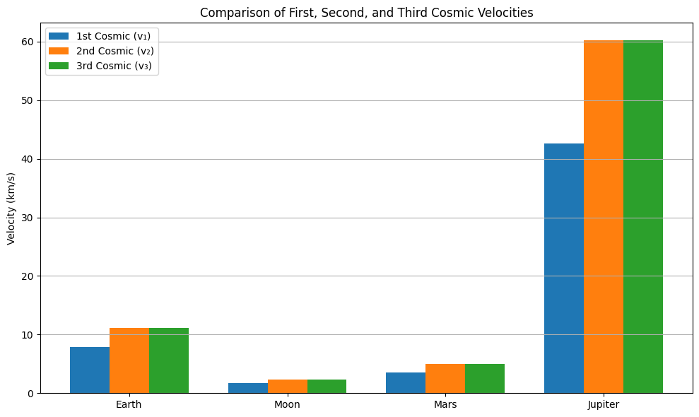

# 📌 Cosmic Velocities: Derivation, Values and Visual Comparison

## Motivation

The concept of escape velocity is crucial for understanding the conditions required to leave a celestial body's gravitational influence. Extending this concept, the first, second, and third cosmic velocities define the thresholds for orbiting, escaping, and leaving a star system. These principles underpin modern space exploration, from launching satellites to interplanetary missions.

## Introduction to Cosmic Velocities

Cosmic velocities are fundamental thresholds that determine the type of motion a body can achieve relative to a planetary or celestial body. There are three main cosmic velocities, each derived from Newtonian mechanics and energy principles:

---

### 🔹 First Cosmic Velocity – Orbital Velocity ($v₁$)

This is the minimum speed required for an object to enter a stable circular orbit just above the surface of a celestial body.

$$
v_1 = \sqrt{\frac{GM}{R}}
$$

Where:
- ( $G$ ) is the gravitational constant  
- ( $M$ ) is the mass of the planet  
- ( $R$ ) is the planet’s radius

#### Physical Meaning:
This is the exact velocity required to stay in a circular orbit just above a planet’s surface. At this speed, the gravitational pull provides the necessary centripetal force to maintain the orbit, and the object will continue circling the planet without falling or escaping.

This velocity results from equating gravitational force (providing centripetal acceleration) with the required centripetal force for circular motion. It represents the minimum horizontal speed an object needs to remain in a stable orbit just above the planet's surface.

---

### 🔹 Second Cosmic Velocity – Escape Velocity ($v₂$)

This is the speed required to escape the gravitational pull of the body without further propulsion.

$$
v_2 = \sqrt{2} \cdot v_1 = \sqrt{\frac{2GM}{R}}
$$

#### Physical Meaning:
This is the minimum speed needed to break free from a planet’s gravity entirely. If an object reaches this speed, it will move infinitely far away without ever falling back, assuming no other forces act on it (like drag or propulsion).

Derived from conservation of energy, this velocity ensures that the object's kinetic energy is enough to overcome the planet's gravitational potential and escape into space without further propulsion.

---

### 🔹 Third Cosmic Velocity – Interstellar Escape ($v₃$)

This is the speed needed to escape the gravitational influence of the star (e.g., the Sun) from orbit around a planet.  
It depends on the relative position and gravity of both the planet and the star. A simplified form (at planetary surface):

$$
v_3 \approx \sqrt{2 \cdot \frac{GM}{R}}
$$

#### Physical Meaning:
This is the speed an object must reach to escape the gravity of the entire solar system starting from Earth’s orbit. It goes beyond just escaping Earth—it ensures the spacecraft also overcomes the gravitational influence of the Sun.

This form is often close to $(v_2)$, but true third cosmic velocity also accounts for the star’s escape energy.

This is the velocity required to escape the Sun’s gravitational field from the orbit of a planet (e.g., Earth). It assumes the object is already outside the planet’s influence and must now escape the solar potential well.

---

## 🌍 Example Values for Earth

Using:
- $( G = 6.67430 \times 10^{-11} \ \mathrm{m^3/kg/s^2} )$
- $( M_{\text{Earth}} = 5.972 \times 10^{24} \ \mathrm{kg} )$
- $( R_{\text{Earth}} = 6.371 \times 10^6 \ \mathrm{m} )$

We get:

- $( v_1 \approx 7.91 \ \mathrm{km/s} )$  
- $( v_2 \approx 11.18 \ \mathrm{km/s} )$ 
- $( v_3 \approx 16.68 \ \mathrm{km/s} ) (approximate)$

---

## 🌑 **Example Values for the Moon**

Using:
- $( G = 6.67430 \times 10^{-11} \ \mathrm{m^3/kg/s^2} )$
- $( M_{\text{Moon}} = 7.348 \times 10^{22} \ \mathrm{kg} )$
- $( R_{\text{Moon}} = 1.737 \times 10^6 \ \mathrm{m} )$

We get:
- $( v_1 \approx 1.68 \ \mathrm{km/s} )$
- $( v_2 \approx 2.38 \ \mathrm{km/s} )$
- $( v_3 \approx 29.62 \ \mathrm{km/s} ) (approximate)$ 

---

## 🔴 **Example Values for Mars**

Using:
- $( M_{\text{Mars}} = 6.417 \times 10^{23} \ \mathrm{kg} )$
- $( R_{\text{Mars}} = 3.390 \times 10^6 \ \mathrm{m} )$

We get:
- $( v_1 \approx 3.55 \ \mathrm{km/s} )$
- $( v_2 \approx 5.02 \ \mathrm{km/s} )$
- $( v_3 \approx 34.13 \ \mathrm{km/s} ) (approximate)$

---

## 🟠 **Example Values for Jupiter**

Using:
- $( M_{\text{Jupiter}} = 1.898 \times 10^{27} \ \mathrm{kg} )$
- $( R_{\text{Jupiter}} = 6.9911 \times 10^7 \ \mathrm{m} )$

We get:
- $( v_1 \approx 42.1 \ \mathrm{km/s} )$
- $( v_2 \approx 59.5 \ \mathrm{km/s} )$
- $( v_3 \approx 62.98 \ \mathrm{km/s} ) (approximate)$

---

## 📊 Visual Comparison: Earth, Moon, Mars, Jupiter

The plot below shows the first, second, and third cosmic velocities for four celestial bodies.  
It clearly demonstrates how mass and radius affect orbital and escape conditions:

- [Colab Link](https://colab.research.google.com/drive/1EwEYPNnBltU-9bCbTZHNJDGAjaY37x8w#scrollTo=yv_8SXBH8n6U)

---

### 🔎 Observations

- **Jupiter** requires the highest velocities due to its massive size.
- **The Moon** has the lowest thresholds due to low mass and small radius.
- **Earth** and **Mars** lie in between, showing the increasing requirements for planetary missions.
- The first and second velocities differ by a factor of $( \sqrt{2} )$, confirming theoretical expectations.

---

This derivation and comparison deepen our understanding of orbital mechanics and are essential for planning launches, interplanetary travel, and satellite deployment.

---

## 🚀 Importance of Cosmic Velocities in Space Exploration

Cosmic velocities are not just theoretical values — they are essential in the design and execution of real-world space missions:

- **First cosmic velocity** is critical when placing satellites into stable Earth orbits. Whether it's for GPS, communication, or Earth observation, accurate orbital speeds ensure long-term stability without excessive fuel usage.

- **Second cosmic velocity** defines the threshold for escaping Earth’s gravity. Every mission to the Moon, Mars, or beyond must surpass this limit to enter interplanetary trajectories.

- **Third cosmic velocity** applies to missions aiming to leave the Solar System entirely. Spacecraft like Voyager 1 and 2 required this energy level to ultimately become interstellar probes.

By understanding these thresholds, mission designers can calculate launch windows, propulsion needs, and energy budgets for everything from small CubeSats to deep space exploration.

---

## 🧾 Conclusion

In this project, we explored the derivation, interpretation, and applications of the three cosmic velocities:

- We derived their mathematical foundations using Newtonian mechanics and energy conservation.
- We provided real-world values for Earth, Moon, Mars, and Jupiter.
- A visual comparison helped illustrate how mass and radius influence these thresholds.
- Finally, we discussed the real importance of these speeds in planning and executing space missions.

This work emphasizes that cosmic velocities are not abstract concepts, but fundamental tools in understanding and navigating gravitational environments in the Solar System and beyond.

