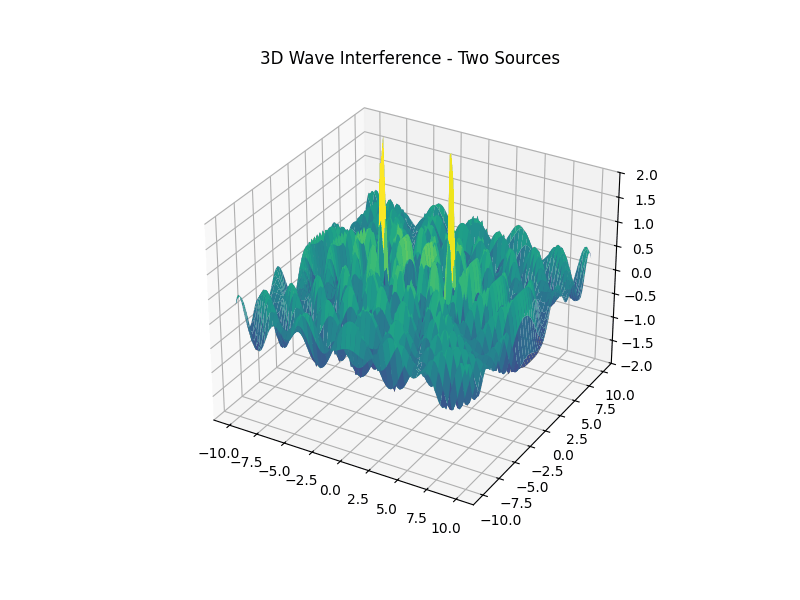
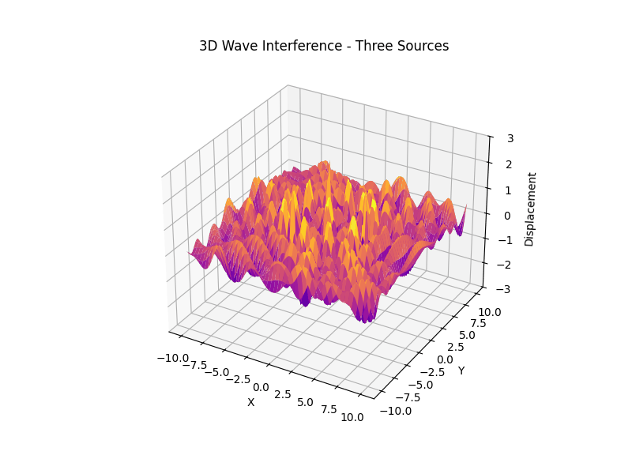

# 📌 Interference Patterns On A Water Surface

## Motivation

Interference occurs when waves from different sources overlap, creating new patterns. On a water surface, this can be easily observed when ripples from different points meet, forming distinctive interference patterns. These patterns can show us how waves combine in different ways, either reinforcing each other or canceling out.

Studying these patterns helps us understand wave behavior in a simple, visual way. It also allows us to explore important concepts, like the relationship between wave phase and the effects of multiple sources. This task offers a hands-on approach to learning about wave interactions and their real-world applications, making it an interesting and engaging way to dive into wave physics.

## 🌊 Wave Interference from Multiple Point Sources

### 🔬 Theoretical Background

Wave interference occurs when two or more waves superpose in space, creating regions of constructive and destructive interference. When the sources are coherent and emit waves with the same amplitude, frequency, and wavelength, the superposition can lead to beautiful and physically meaningful interference patterns.

The displacement of a water surface by a circular wave originating from a point source $(x_0, y_0)$ is given by:

$$
\eta(x, y, t) = \frac{A}{\sqrt{r}} \cdot \cos(kr - \omega t + \phi)
$$

Where:

- $A$: Amplitude of the wave  
- $r = \sqrt{(x - x_0)^2 + (y - y_0)^2}$: Distance from the source  
- $k = \frac{2\pi}{\lambda}$: Wave number  
- $\omega = 2\pi f$: Angular frequency  
- $\phi$: Phase shift  

If there are $N$ point sources, the total displacement is:

$$
\eta_{\text{sum}}(x, y, t) = \sum_{i=1}^{N} \eta_i(x, y, t)
$$

---

## 🌊 Wave Pattern from a Single Point Source

In this first example, we simulate a wave generated by a single point source at the center of the domain. The wave propagation follows the equation:

$$
\eta(x, y, t) = \frac{A}{\sqrt{r}} \cdot \cos(kr - \omega t + \phi)
$$

Where:

- $(A)$ is the amplitude,  
- $( r = \sqrt{(x - x_0)^2 + (y - y_0)^2} )$ is the distance from the source to the point $((x, y))$,  
- $( k = \frac{2\pi}{\lambda} )$ is the wave number,  
- $( \omega = 2\pi f )$ is the angular frequency,  
- $( \phi )$ is the initial phase,  
- $( \eta(x, y, t) )$ is the water surface displacement.

This scenario demonstrates the radial symmetry of the wavefronts from a single source. Amplitude decreases with distance due to the $( \frac{1}{\sqrt{r}} )$ decay, while the phase advances as the wave propagates outward.

- [Colab Link](https://colab.research.google.com/drive/11yf8w1PnX--a09eR8RNv-VjODbHOtyzK#scrollTo=7JdtqSFQEzhh)

---

## 🌊 Wave Interference from Two Point Sources

When two coherent point sources emit waves of the same frequency and amplitude, the resulting pattern on the surface is a combination of constructive and destructive interference.

The total displacement at any point is given by the sum of the contributions from both sources:

$$
\eta_{\text{total}}(x, y, t) = \eta_1(x, y, t) + \eta_2(x, y, t)
$$

Each wave contribution is defined as:

$$
\eta_i(x, y, t) = \frac{A}{\sqrt{r_i}} \cdot \cos(k r_i - \omega t + \phi)
$$

Where:

- $( r_i )$ is the distance from the $i$-th source to the point $((x, y))$,
- $( A )$ is the amplitude,
- $( k = \frac{2\pi}{\lambda} )$ is the wave number,
- $( \omega = 2\pi f )$ is the angular frequency.

### Key Characteristics:

- **Constructive Interference** occurs where the path difference is an integer multiple of the wavelength:
  $$
  r_1 - r_2 = n \lambda
  $$
- **Destructive Interference** occurs where the path difference is a half-integer multiple of the wavelength:
  $$
  r_1 - r_2 = \left(n + \frac{1}{2}\right) \lambda
  $$

These regions form interference fringes that radiate from between the two sources. This is the same principle used in classic **double-slit experiments** in optics and wave physics.

- [Colab Link](https://colab.research.google.com/drive/1FXoLXgAWlr1jJTq1sMn03OLoS-yV1fjG)

---

## 🌊 Wave Interference from Three Point Sources (Triangle Configuration)

When three coherent wave sources are arranged in an equilateral triangle, they emit circular waves that interfere to create a highly symmetric and intricate pattern.

Each point source contributes a wave defined by:

$$
\eta_i(x, y, t) = \frac{A}{\sqrt{r_i}} \cdot \cos(k r_i - \omega t + \phi)
$$

Where:

- $( r_i = \sqrt{(x - x_i)^2 + (y - y_i)^2} )$ is the distance from the $i$-th source,  
- $( A )$ is amplitude,  
- $( k = \frac{2\pi}{\lambda} )$ is the wave number,  
- $( \omega = 2\pi f )$ is the angular frequency.

The total displacement is the sum of all three sources:

$$
\eta_{\text{total}}(x, y, t) = \eta_1 + \eta_2 + \eta_3
$$

### Characteristics:

- Interference fringes become more **radially symmetric and dense** compared to the two-source case.
- The **center of the triangle** becomes a point of high constructive interference (if phases are equal).
- As symmetry increases, **interference complexity** rises dramatically.

Such patterns are often used in **acoustic array calibration**, **antenna beam shaping**, and **waveform holography**, where symmetric arrangements are crucial for predictable interference fields.

- [Colab Link](https://colab.research.google.com/drive/1MVsP7twcX11IsQunkEbQ2OafVqnsAzEr#scrollTo=egviEWHdUkTj)

---

## 🌐 3D Wave Interference with Multiple Point Sources

In this extended model, we analyze **three-dimensional wave interference** from multiple coherent point sources located in space. Each source emits **spherical waves**, and the resulting wave field is formed by the superposition of all individual wave contributions.

The displacement at a point \((x, y, z)\) from a point source located at \((x_i, y_i, z_i)\) is given by:

$$
\eta_i(x, y, z, t) = \frac{A}{r_i} \cdot \cos(k r_i - \omega t + \phi)
$$

with:

$$
r_i = \sqrt{(x - x_i)^2 + (y - y_i)^2 + (z - z_i)^2}
$$

The **total wave field** from \( N \) sources becomes:

$$
\eta_{\text{total}}(x, y, z, t) = \sum_{i=1}^{N} \eta_i(x, y, z, t)
$$

---

### Configurations:

- **Two Sources (Dual Center):**  
  When two sources are placed along a line (e.g., x-axis), the interference pattern forms symmetric lobes along the axis perpendicular to the source separation — similar to classical double-slit interference, but in 3D.

- **Three Sources (Triangular Configuration):**  
  Arranging three sources at the vertices of a triangle in 3D space leads to a more complex volumetric interference pattern. Depending on phase alignment and spacing, these patterns can form central constructive cores or multiple layered lobes.

---

- [Colab Link](https://colab.research.google.com/drive/12P84wvZ4UQv-pWdhEJGlMDVIAc2rii2_#scrollTo=xiJ_IaBSW4Cc)

- [Colab Link](https://colab.research.google.com/drive/1yOgFmiPkIF0XB7ZWxDdjLELvxbLURTVP)

##  Real-World Applications

Wave interference and similar principles are used in:

- **Radar systems** – signal interference analysis  
- **Optics** – double-slit experiments and holography  
- **Antenna design** – beam forming and array configuration  
- **Acoustics** – concert hall sound patterning  
- **Seismology** – studying overlapping shockwave data

---

## 📌 Conclusion
This project provides a hands-on exploration of wave interference using fundamental principles of physics and computational modeling. Visualizing superposition from symmetric polygon configurations reveals the profound beauty and complexity hidden within simple equations—demonstrating not only theoretical concepts but also their wide applications from acoustics to radar.