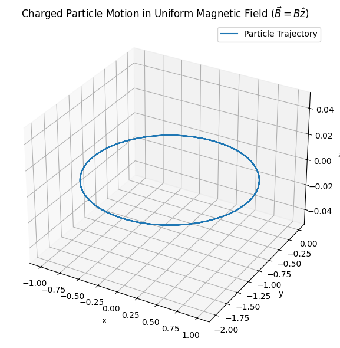
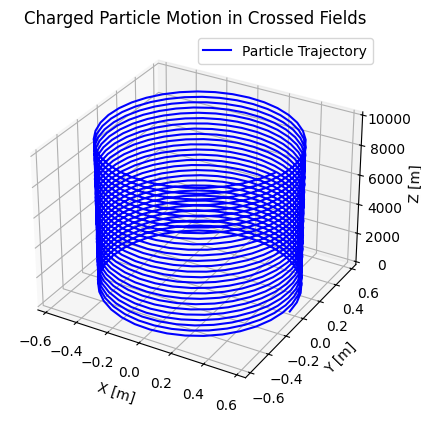
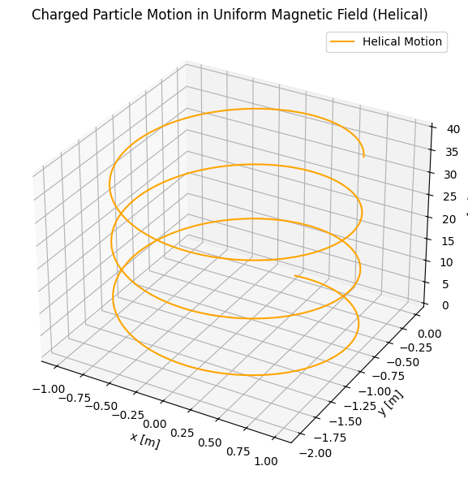
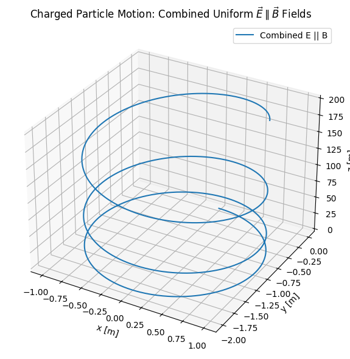

# Simulating the effects of the Lorentz Force

## Motivation

The Lorentz force, expressed as $\mathbf{F} = q\mathbf{E} + q\mathbf{v} \times \mathbf{B}$, governs the motion of charged particles in electric and magnetic fields. It is foundational in fields like plasma physics, particle accelerators, and astrophysics. By focusing on simulations, we can explore the practical applications and visualize the complex trajectories that arise due to this force.

## 🔬 Theoretical Background

The motion of a charged particle in electric and magnetic fields is governed by the **Lorentz force**:

$$
\vec{F} = q\vec{E} + q\vec{v} \times \vec{B}
$$

Where:  
- $q$ is the electric charge of the particle,  
- $\vec{E}$ is the electric field vector,  
- $\vec{B}$ is the magnetic field vector,  
- $\vec{v}$ is the velocity of the particle.  

This expression combines two key phenomena:
1. **Electric force**: $q\vec{E}$ — accelerates the particle linearly in the direction of the field.
2. **Magnetic force**: $q\vec{v} \times \vec{B}$ — acts perpendicular to both the velocity and the magnetic field, causing circular or helical motion.

---

### 🧲 Magnetic Field Only

When $\vec{E} = 0$ and a uniform magnetic field $\vec{B}$ is present, the equation becomes:

$$
\vec{F} = q\vec{v} \times \vec{B}
$$

This results in **circular motion** of the charged particle in the plane perpendicular to $\vec{B}$. The radius of the circular path (Larmor radius) is:

$$
r = \frac{mv_\perp}{|q|B}
$$

And the angular frequency (cyclotron frequency) is:

$$
\omega = \frac{|q|B}{m}
$$

Where:  
- $v_\perp$ is the component of velocity perpendicular to $\vec{B}$,  
- $m$ is the mass of the particle.

If there’s a velocity component parallel to $\vec{B}$, the motion becomes **helical**.

---

### ⚡ Electric and Magnetic Fields (Crossed Fields)

When both $\vec{E}$ and $\vec{B}$ are nonzero and perpendicular to each other, the particle undergoes a **drift motion**. The drift velocity is given by:

$$
\vec{v}_d = \frac{\vec{E} \times \vec{B}}{B^2}
$$

This is known as the **$\vec{E} \times \vec{B}$ drift** and occurs regardless of the particle's charge or mass.

---

### 🧮 Equation of Motion

We simulate the system by numerically solving Newton's second law:

$$
m \frac{d\vec{v}}{dt} = q\vec{E} + q\vec{v} \times \vec{B}
$$

This results in a system of coupled differential equations that cannot be solved analytically in the general case, especially when $\vec{E}$ and $\vec{B}$ are functions of time or position. Therefore, we will use numerical integration methods to explore particle trajectories under various field configurations.

## 💻 Why Runge-Kutta Method?

The motion of a charged particle in electric and magnetic fields is governed by a system of coupled, nonlinear differential equations:

$$
m\frac{d\vec{v}}{dt} = q\vec{E} + q\vec{v} \times \vec{B}
$$

These equations are typically **not solvable analytically**, especially in the general case where $\vec{E}$ and $\vec{B}$ vary in space or time. Therefore, we must use **numerical integration techniques** to approximate the particle’s trajectory.

Among the available methods, the **Runge-Kutta 4th order (RK4)** algorithm offers a good balance between **accuracy** and **computational efficiency**. It reduces the local truncation error significantly compared to simpler methods like Euler's method.

The RK4 update steps for velocity $\vec{v}$ and position $\vec{r}$ are defined as:

- **Velocity update:**

$$
\vec{v}_{n+1} = \vec{v}_n + \frac{1}{6}(k_1^v + 2k_2^v + 2k_3^v + k_4^v)
$$

- **Position update:**

$$
\vec{r}_{n+1} = \vec{r}_n + \frac{1}{6}(k_1^r + 2k_2^r + 2k_3^r + k_4^r)
$$

Where:

$$
\begin{align*}
k_1^v &= a(\vec{v}_n)\Delta t \\
k_2^v &= a\left(\vec{v}_n + \frac{1}{2}k_1^v\right)\Delta t \\
k_3^v &= a\left(\vec{v}_n + \frac{1}{2}k_2^v\right)\Delta t \\
k_4^v &= a\left(\vec{v}_n + k_3^v\right)\Delta t \\
\\
k_i^r &= \text{corresponding velocity step} \times \Delta t
\end{align*}
$$

Here, $a(\vec{v})$ is the acceleration given by the Lorentz force:

$$
a(\vec{v}) = \frac{q}{m}(\vec{E} + \vec{v} \times \vec{B})
$$

This method allows us to simulate the particle’s motion with high temporal resolution, which is critical when studying fast-changing trajectories under Lorentz dynamics.

---

## 🔄 Particle in Uniform Magnetic Field

We consider a charged particle with an initial velocity perpendicular to a uniform magnetic field $\vec{B} = B\hat{z}$. The electric field is zero: $\vec{E} = 0$.

The Lorentz force becomes:

$$
\vec{F} = q\vec{v} \times \vec{B}
$$

This results in circular motion in the $xy$-plane with constant speed.

- **Radius (Larmor Radius):**
  $$
  r = \frac{mv_\perp}{|q|B}
  $$

- **Cyclotron Frequency:**
  $$
  \omega = \frac{|q|B}{m}
  $$

- **Motion type:** Uniform circular motion.

---

- [Colab Link](https://colab.research.google.com/drive/1cYMk0DihAwJu1_vulPX0knDjh-iaXyVs)

---

> The particle moves in a perfect circle when its initial velocity is perpendicular to $\vec{B}$. No energy is gained or lost, and the speed remains constant.

---
## ⚡Crossed Electric and Magnetic Fields

We now consider a case where the electric and magnetic fields are perpendicular:

- $\vec{E} = [1, 0, 0]$
- $\vec{B} = [0, 0, 1]$

Initial velocity is set to $\vec{v}_0 = [0, 1, 0]$.

The Lorentz force becomes:

$$
\vec{F} = q(\vec{E} + \vec{v} \times \vec{B})
$$

This setup leads to a combination of **circular motion** due to the magnetic field and **linear drift** due to the cross product of the fields. The net drift velocity is given by:

$$
\vec{v}_d = \frac{\vec{E} \times \vec{B}}{B^2}
$$

For our configuration:

$$
\vec{v}_d = \frac{[1, 0, 0] \times [0, 0, 1]}{1^2} = [0, 1, 0]
$$

---

- [Colab Link](https://colab.research.google.com/drive/1cUzZwjM_nmXfNO2FLzIOTrHTVrdsM8jL)

---

> The charged particle exhibits a spiral trajectory in the $xy$-plane, superimposed with a constant drift in the $y$-direction. This is characteristic of $\vec{E} \times \vec{B}$ drift.

## 🧪 Parameter Exploration

In this section, we explore how different physical parameters affect the trajectory of a charged particle under the Lorentz force.

---

### 1. Field Strengths: $\vec{E}$ and $\vec{B}$

- Increasing the **magnetic field strength** ($B$) results in a **tighter spiral** (smaller Larmor radius):

  $$
  r = \frac{mv_\perp}{|q|B}
  $$

  A stronger $B$ also increases the **cyclotron frequency**:

  $$
  \omega = \frac{|q|B}{m}
  $$

- Increasing the **electric field strength** ($E$) enhances the **$\vec{E} \times \vec{B}$ drift**:

  $$
  \vec{v}_d = \frac{\vec{E} \times \vec{B}}{B^2}
  $$

---

### 2. Initial Velocity: $\vec{v}_0$

- The **perpendicular component** $v_\perp$ determines the radius of rotation in the $xy$-plane.
- The **parallel component** $v_\parallel$ causes **helical stretching** along the direction of $\vec{B}$.

By varying the initial velocity vector, the particle’s motion can transition from circular → helical → linear.

---

### 3. Charge and Mass: $q$ and $m$

- The sign of $q$ affects the **direction of rotation**.
- The **$q/m$ ratio** controls how tightly and how fast the particle rotates:

  $$
  \omega = \frac{|q|B}{m}
  $$

  A particle with a high $q/m$ (like an electron) rotates more tightly and faster than a heavier particle (like a proton) in the same field.

---

> By adjusting each parameter, we can simulate a wide variety of real-world scenarios — from slow-moving ions in traps to high-speed electrons in accelerators.

## 🔁 Helical Motion in Uniform Magnetic Field

We now consider a charged particle moving in a uniform magnetic field with a velocity that has both perpendicular and parallel components:

- $\vec{B} = [0, 0, 1]$
- $\vec{E} = [0, 0, 0]$
- $\vec{v}_0 = [1, 0, 2]$

The magnetic field causes circular motion in the $xy$-plane, while the $z$-component of velocity remains unaffected, leading to a **helical trajectory**:

$$
\vec{F} = q\vec{v} \times \vec{B}
$$

- [Colab Link](https://colab.research.google.com/drive/16ca9i5JQvuQM1-RuDp2obsS3rAK3u77h)

> "The particle rotates in the $xy$-plane while moving linearly along the $z$-axis. This results in a constant-pitch helical path around the magnetic field direction."

## ⚡ Combined Uniform $\vec{E} \parallel \vec{B}$ Fields

We now consider a scenario where both the electric and magnetic fields are uniform and aligned in the same direction, typically along the $z$-axis:

- $\vec{E} = [0, 0, E]$
- $\vec{B} = [0, 0, B]$
- $\vec{v}_0 = [v_x, 0, 0]$

The Lorentz force becomes:

$$
\vec{F} = q(\vec{E} + \vec{v} \times \vec{B})
$$

- The **magnetic field** causes circular motion in the $xy$-plane.
- The **electric field** causes continuous acceleration in the $z$-direction.

This combination produces a **spiral trajectory that stretches along the field lines**, with increasing pitch as the particle accelerates.

---

- [Colab Link](https://colab.research.google.com/drive/1YLZIo54Wj3sZYHPOs4uMMR3bSXle29ub)

> "The electric field causes the particle to accelerate along $\vec{B}$, stretching the helix. The motion combines uniform circular rotation and linear acceleration."

## 🔍 Discussion: Relevance to Real-World Applications

The simulated trajectories presented in this project are not just mathematical curiosities — they closely model real-world behavior of charged particles in various technological and natural environments.

---

### 🌀 Cyclotron and Synchrotron Devices

- Circular and helical motion in uniform magnetic fields is fundamental to **cyclotrons** and **synchrotrons**, which accelerate charged particles in controlled magnetic environments.
- The radius and frequency of motion are key to tuning these machines:

$$
r = \frac{mv_\perp}{|q|B}, \quad \omega = \frac{|q|B}{m}
$$

---

### ☢️ Magnetic Confinement in Plasma Physics

- Devices like **tokamaks** and **stellarators** rely on $\vec{E} \times \vec{B}$ drift and magnetic curvature to confine plasma and maintain stability.
- Understanding drift motion is essential for reducing energy losses and predicting particle escape.

---

### 🛰️ Satellite and Spacecraft Dynamics

- In Earth's magnetosphere, charged particles (such as solar wind ions) undergo **helical motion**, mirroring the behavior we simulated.
- Accurate models are required to protect satellites from radiation and optimize spacecraft trajectories.

---

### 🔬 Mass Spectrometry and Particle Detectors

- Mass spectrometers exploit differences in particle curvature under magnetic fields to identify atomic species.
- By knowing the $q/m$ ratio, we can determine the identity of an unknown ion from its circular trajectory radius.

---

> These examples demonstrate how the Lorentz force governs critical behaviors in physics and engineering, and why simulations like these are crucial for both education and real-world design.

## ✅ Conclusion

In this project, we studied the motion of a charged particle under the influence of electric and magnetic fields by simulating various physical scenarios using the Lorentz force:

$$
\vec{F} = q\vec{E} + q\vec{v} \times \vec{B}
$$

---

### 🔍 What We Did

- We implemented the **Runge-Kutta 4th order** method to numerically solve the coupled differential equations governing particle motion.
- We simulated and visualized the following cases:
  - Uniform magnetic field → circular and helical motion
  - Crossed electric and magnetic fields → $\vec{E} \times \vec{B}$ drift
  - Combined uniform $\vec{E} \parallel \vec{B}$ → expanding spiral motion
- We explored how key parameters like $B$, $E$, $v_0$, $q/m$ influence the resulting trajectories.

---

### 🌍 Why It Matters

These simulations reflect real-world behaviors in:
- Particle accelerators (cyclotrons, synchrotrons)
- Plasma confinement systems (tokamaks, fusion devices)
- Mass spectrometry and ion traps
- Space physics and satellite environments

Understanding the motion of charged particles in fields is foundational for modern physics and engineering applications. Simulations allow us to visualize these complex trajectories and gain deeper intuition beyond analytical solutions.

---

