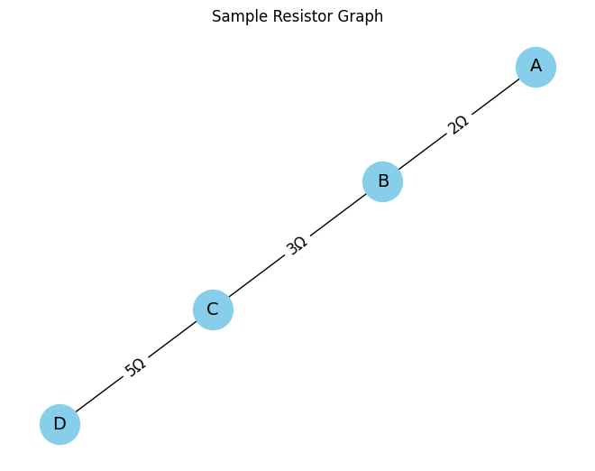
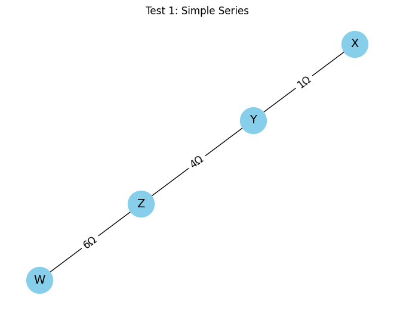
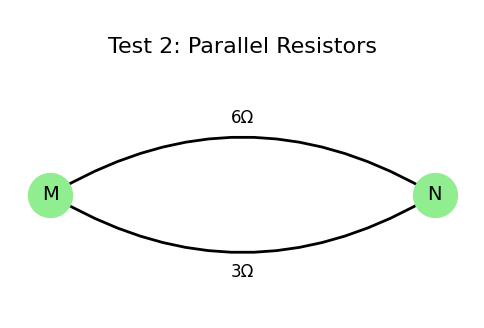
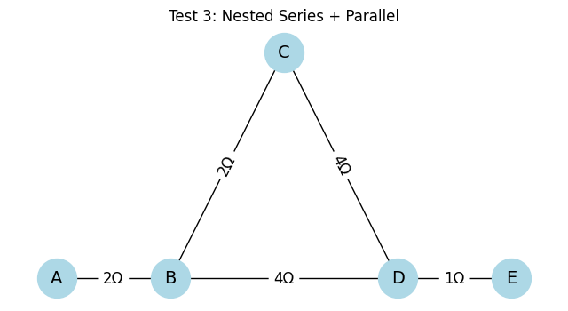

# Equivalent Resistance Using Graph Theory

## Motivation

Calculating equivalent resistance is a fundamental problem in electrical circuits, essential for understanding and designing efficient systems. While traditional methods involve iteratively applying series and parallel resistor rules, these approaches can become cumbersome for complex circuits with many components. Graph theory offers a powerful alternative, providing a structured and algorithmic way to analyze circuits.

By representing a circuit as a graph—where nodes correspond to junctions and edges represent resistors with weights equal to their resistance values—we can systematically simplify even the most intricate networks. This method not only streamlines calculations but also opens the door to automated analysis, making it particularly useful in modern applications like circuit simulation software, optimization problems, and network design.

Studying equivalent resistance through graph theory is valuable not only for its practical applications but also for the deeper insights it provides into the interplay between electrical and mathematical concepts. This approach highlights the versatility of graph theory, demonstrating its relevance across physics, engineering, and computer science.

## 📚 2. Theoretical Background

### Graph-Based Circuit Representation

In this project, we use an undirected, weighted graph to represent an electrical resistor network:

- **Node (vertex):** A connection point or junction in the circuit.
- **Edge:** A resistor, which connects two nodes and has a numerical weight corresponding to its resistance (in ohms, Ω).

This representation allows us to treat the resistor network as a data structure that can be analyzed and simplified using graph theory techniques.

---

### Equivalent Resistance Rules

#### 🔸 Series Connection

Two or more resistors are said to be in series if they are connected end-to-end and share a single common node, with no branching in between.

The total (equivalent) resistance is the sum of all resistors:

$R_{\text{eq}} = R_1 + R_2 + \cdots + R_n$

#### 🔸 Parallel Connection

Two or more resistors are in parallel if both ends of each resistor are connected to the same two nodes.

The total equivalent resistance is given by:

$\frac{1}{R_{\text{eq}}} = \frac{1}{R_1} + \frac{1}{R_2} + \cdots + \frac{1}{R_n}$

---

### Reduction Strategy in Graphs

To simplify a resistor network graphically:

1. **Detect series connections:** A node with exactly two neighbors can indicate a series connection.
2. **Detect parallel connections:** Multiple edges between the same pair of nodes imply parallel resistors.
3. **Iteratively reduce:** At each step, merge equivalent resistors and update the graph, until only two terminal nodes remain.

These operations are repeated automatically by the algorithm until the entire network is reduced to a single equivalent resistance value.

## ⚙️ 3. Algorithm Implementation

To compute the equivalent resistance of a complex circuit, we implement a graph-based algorithm using Python and the NetworkX library.

Each resistor is modeled as an edge in an undirected graph. The resistance value is stored as a weight (or attribute) on the edge.

---

### 🛠️ Libraries Used

- `networkx`: for graph creation and manipulation
- `matplotlib`: for optional visualization (not required for calculations)

---

### 🧱 Basic Graph Setup

Below is a sample Python code block to create a simple resistor network using NetworkX:

---

### ✅ Test 1: Simple Series

**Description:**  
A set of three resistors is connected in a straight line between four distinct nodes.

**Connections:**

- X–Y: 1Ω  
- Y–Z: 4Ω  
- Z–W: 6Ω

**Expected Result:**

$R_{\text{eq}} = 1 + 4 + 6 = 11\,\Omega$

[link](https://tinyurl.com/2yl4rddw)

> "Since all elements are in series, their resistances simply add up. The current remains the same through each resistor."

### ✅ Test 2: Simple Parallel

**Description:**  
Two resistors are connected in parallel between the same two nodes. This creates two paths for the current between nodes M and N.

**Connections:**

- M–N: 6Ω  
- M–N: 3Ω (second path)

**Expected Result:**

Using the parallel resistance formula:

$$
\frac{1}{R_{\text{eq}}} = \frac{1}{6} + \frac{1}{3} = \frac{1}{2} \Rightarrow R_{\text{eq}} = 2\,\Omega
$$

> "Parallel resistors divide the current across multiple paths. The combined resistance is always lower than the smallest individual resistor."

### ✅ Test 3: Nested Combination

**Description:**  
This test involves a more complex configuration where series and parallel resistors are nested inside one another. The goal is to simplify the internal group first, then reduce the outer series.

**Connections:**

- A–B: 2Ω  
- B–C: 2Ω  
- C–D: 4Ω  
- B–D: 4Ω  
- D–E: 1Ω

**Expected Reduction Steps:**

1. B–C–D is in series: $R = 2 + 4 = 6\,\Omega$
2. This path is in parallel with direct B–D:  
   $\frac{1}{R} = \frac{1}{6} + \frac{1}{4} \Rightarrow R = 2.4\,\Omega$
3. A–B and D–E are in series:  
   $R_{\text{eq}} = 2 + 2.4 + 1 = 5.4\,\Omega$

> "First reduce the inner path, then treat the whole circuit as a single line."

