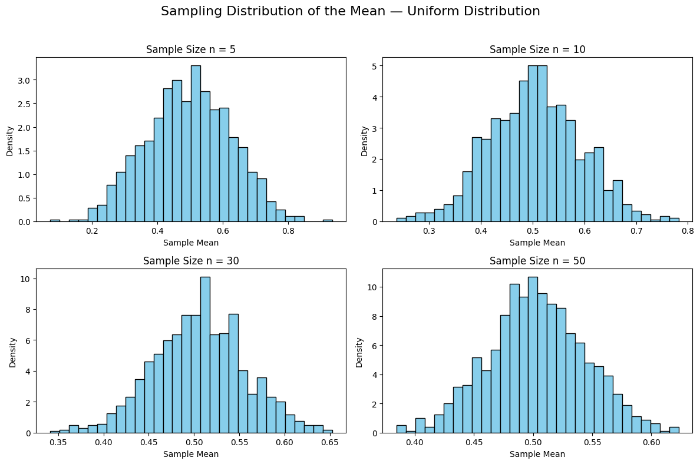
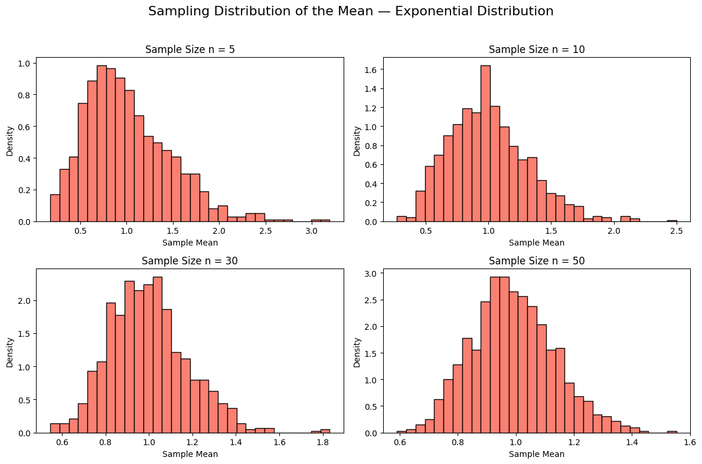
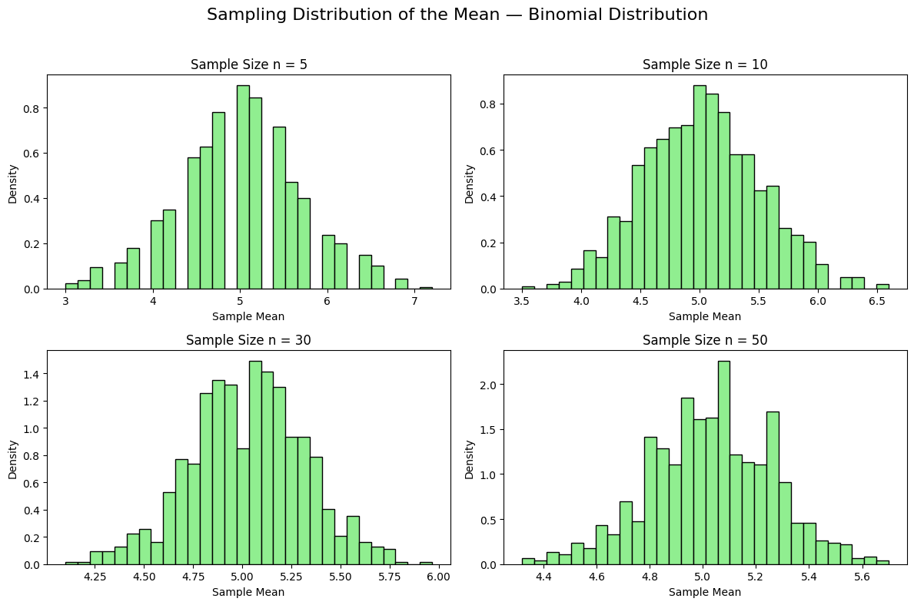

# Exploring the Central Limit Theorem through simulations

## Motivation 

The Central Limit Theorem (CLT) is a cornerstone of probability and statistics, stating that the sampling distribution of the sample mean approaches a normal distribution as the sample size increases, regardless of the population’s original distribution. Simulations provide an intuitive and hands-on way to observe this phenomenon in action.

### Sampling Distribution of the Mean — Uniform Distribution

In this section, we demonstrate the Central Limit Theorem (CLT) by applying it to a population generated from a uniform distribution. A uniform distribution is flat, meaning every value in a given range has an equal probability of occurring. Despite this non-normal shape, the CLT predicts that the sampling distribution of the mean will approach a normal distribution as the sample size increases.

We generate a large population of 10,000 data points from a uniform distribution ranging from 0 to 1. Then, we draw random samples of size $n = 5,\ 10,\ 30,\ 50$. For each sample size, we repeat the sampling process 1000 times and record the mean of each sample. Histograms of these sample means reveal how the distribution becomes increasingly bell-shaped with larger $n$.

This simulation visually confirms that the CLT holds true even when the original population is far from normal.

- [Colab Link](https://colab.research.google.com/drive/1_w6bO_gBLdjKg_YeK06n3VG7NG5F6ls8#scrollTo=qVNFp31L-Gm1)

### Sampling Distribution of the Mean — Exponential Distribution

In this section, we test the Central Limit Theorem using a population drawn from an exponential distribution. Unlike the uniform distribution, the exponential distribution is highly skewed to the right and represents many real-world processes such as waiting times or radioactive decay.

We generate a population of 10,000 values from an exponential distribution with a rate parameter $\lambda = 1$, which corresponds to a mean of $1$. We then draw 1000 random samples for each sample size $n = 5,\ 10,\ 30,\ 50$ and calculate the sample means.

Despite the heavy skew of the original population, the sampling distributions of the mean become more symmetric and bell-shaped as $n$ increases, providing further confirmation of the Central Limit Theorem.

- [Colab Link](https://colab.research.google.com/drive/1h9eKUFSmU_tRGinqr7Zg0WHKs5surqvn)

### Sampling Distribution of the Mean — Binomial Distribution

In this final simulation, we apply the Central Limit Theorem to a population generated from a binomial distribution. The binomial distribution represents discrete outcomes such as coin flips, and it is often used to model probabilities in binary events (success/failure).

We create a population of 10,000 values using a binomial distribution with parameters $n = 10$ (number of trials) and $p = 0.5$ (success probability), which yields a mean of $5$.

As in previous simulations, we draw 1000 random samples for each sample size $n = 5,\ 10,\ 30,\ 50$ and compute the mean of each sample. We then plot the distribution of the sample means to observe how they behave.

The binomial distribution is discrete and non-continuous, but as the sample size increases, the sampling distribution of the mean becomes smoother and approaches a normal shape, again confirming the CLT.

### 🧠 Analysis and Discussion

In this project, we explored the Central Limit Theorem (CLT) using three different probability distributions: **Uniform**, **Exponential**, and **Binomial**. For each distribution, we simulated a large population, repeatedly took samples of various sizes, and visualized the distribution of sample means.

#### 🔸 Uniform Distribution:
The uniform distribution is symmetric but non-normal in shape. Despite its flat probability density, the distribution of sample means rapidly approached a bell curve as the sample size increased. Even at $n = 10$, the distribution began to resemble a normal distribution, confirming that CLT applies effectively to symmetric distributions.

#### 🔸 Exponential Distribution:
The exponential distribution is heavily skewed, making it an interesting test case for the CLT. As expected, small sample sizes retained much of the skew, but with larger samples ($n = 30$ and $n = 50$), the distribution of sample means smoothed out and became significantly more symmetric. This highlights the power of CLT to overcome strong skewness with sufficient sample size.

#### 🔸 Binomial Distribution:
With parameters $n = 10$ and $p = 0.5$, the binomial distribution is discrete but symmetric. The sampling distribution of the mean quickly approached normality, particularly from $n = 10$ and beyond. This case also confirms that the CLT is not limited to continuous distributions.

#### ✅ Overall Observation:
In all three cases, regardless of the population's original shape (flat, skewed, or discrete), the distribution of the sample means converged toward a normal distribution as the sample size increased. The convergence was faster for symmetric distributions (uniform and binomial), and slower for skewed distributions (exponential).

These results visually and numerically support the Central Limit Theorem, demonstrating its robustness and wide applicability in statistical inference.

### ✅ Conclusion

This project successfully demonstrated the Central Limit Theorem (CLT) through simulation-based analysis of three fundamentally different distributions: uniform, exponential, and binomial.

By generating large synthetic populations and analyzing the sampling distribution of their means for various sample sizes, we confirmed the following key insights:

- The distribution of the sample mean **approaches normality** as the sample size increases, regardless of the shape of the original population distribution.
- **Symmetric distributions** (like the uniform and binomial cases) converge more quickly to a normal distribution compared to **skewed distributions** (like the exponential).
- Even when the original distribution is **discrete or heavily skewed**, the sampling distribution of the mean still becomes approximately normal with a large enough sample size.

These findings reinforce the importance of the CLT in statistics and data science. It provides the theoretical foundation for making probabilistic inferences about population parameters, especially when the population distribution is unknown or non-normal.

The use of simulations allowed for a hands-on, visual confirmation of this fundamental concept, enhancing both understanding and intuition.
