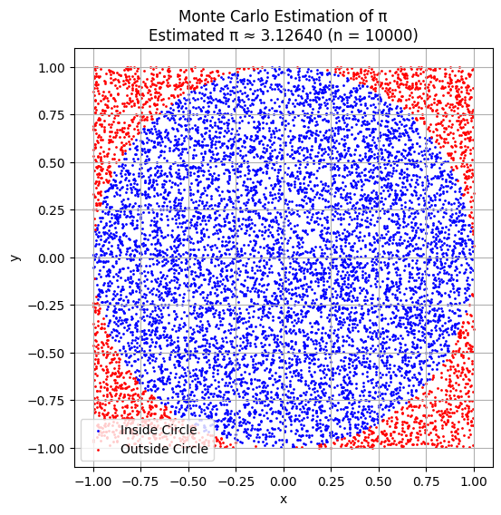
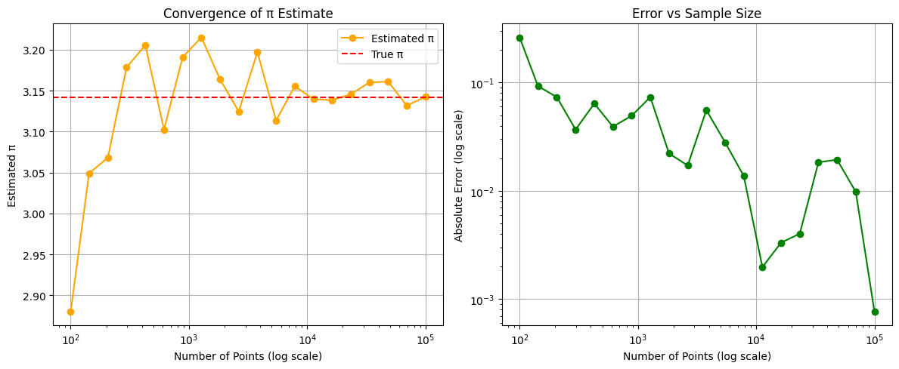
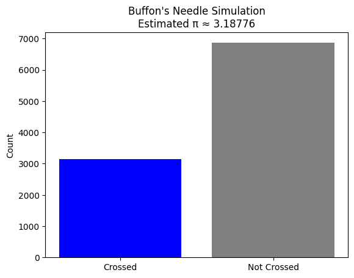

# Estimating Pi using Monte Carlo Methods

## Motivation

Monte Carlo simulations are a powerful class of computational techniques that use randomness to solve problems or estimate values. One of the most elegant applications of Monte Carlo methods is estimating the value of $\pi$ through geometric probability. By randomly generating points and analyzing their positions relative to a geometric shape, we can approximate $\pi$ in an intuitive and visually engaging way.

This problem connects fundamental concepts of probability, geometry, and numerical computation. It also provides a gateway to understanding how randomness can be harnessed to solve complex problems in physics, finance, and computer science. The Monte Carlo approach to 
 estimation highlights the versatility and simplicity of this method while offering practical insights into convergence rates and computational efficiency.

---

### Estimating $\pi$ Using a Circle — Monte Carlo Simulation

 Monte Carlo methods allow us to estimate the value of $\pi$ through a geometric probability approach. The basic idea involves generating random points in a square that bounds a unit circle. The ratio of points that fall inside the circle compared to the total number of points approximates $\pi$ using the relation:

$$
\pi \approx 4 \cdot \frac{\text{points inside the circle}}{\text{total number of points}}
$$

By increasing the number of points, the accuracy of the estimation improves due to the Law of Large Numbers. This method is not only simple to implement, but also demonstrates how randomness and geometry can work together to solve classical problems.

-  [Colab Link](https://colab.research.google.com/drive/15_h1nChGmwyp2ZyvTGJJQOXNzTqoNoU3)

---

### Convergence Behavior of Pi Estimation

One important aspect of Monte Carlo methods is understanding how the accuracy of the estimate improves as the number of samples increases. In this section, we analyze the convergence behavior of the $\pi$ estimate by progressively increasing the number of randomly generated points.

We begin with a small number of points (e.g., 100) and gradually increase it up to 100,000. At each step, we compute the estimate of $\pi$ and compare it to the true value ($\pi \approx 3.14159$). The absolute error is also tracked as a function of sample size.

This analysis highlights how the estimate becomes more accurate and stable with larger sample sizes, illustrating the law of large numbers in practice.

-  [Colab Link](https://colab.research.google.com/drive/1k9pcaGrA6IcVcoXdVgJS_j0ctkKMP3cj)

---

### Estimating $\pi$ Using Buffon’s Needle

Buffon’s Needle is a classic probabilistic method to estimate the value of $\pi$. The idea is to drop a needle of length $\ell$ onto a plane with parallel lines spaced distance $d$ apart. The probability that the needle crosses a line is related to $\pi$ by the formula:

$$
P = \frac{2\ell}{d\pi} \quad \Rightarrow \quad \pi \approx \frac{2\ell N}{dC}
$$

Where:
- $\ell$ is the length of the needle
- $d$ is the distance between the parallel lines ($\ell \leq d$)
- $N$ is the total number of drops
- $C$ is the number of times the needle crosses a line

This method uses randomness and geometric probability to approximate $\pi$. While the convergence is slower than the Monte Carlo circle method, it offers a historically significant and visually intuitive approach.

In the following simulation, we randomly drop needles on a plane and track how often they intersect with the parallel lines to estimate $\pi$.

-  [Colab Link](https://colab.research.google.com/drive/1X5U1aEFiynJtKKQCX4AyYJ3VvBoiqMPo)

---

#### Comparison and Final Discussion

In this project, we explored three different Monte Carlo-based methods for estimating the value of $\pi$:

1. **Monte Carlo Circle Method:**  
   This is a geometric probability method where random points are generated in a square and counted based on whether they fall inside a unit circle. It is simple, fast, and converges reasonably well. The estimate improves as the number of points increases, following the law of large numbers.

2. **Convergence Behavior Analysis:**  
   By progressively increasing the number of points, we observed that the error decreases logarithmically. The estimate stabilizes around the true value of $\pi$, reinforcing the robustness of this method for numerical estimation.

3. **Buffon’s Needle:**  
   A historical and fascinating approach that uses the probability of a randomly dropped needle crossing parallel lines. Although it converges more slowly and has higher variance, it connects probability with geometry in a unique way.

#### 🔍 Summary:

| Method                  | Estimate     | Trials     | Notes                                |
|------------------------|--------------|------------|--------------------------------------|
| Circle Method          | ≈ 3.1228     | 10,000     | Fast convergence, very visual        |
| Convergence Plot       | → 3.14159    | 100–100,000| Log-scale analysis shows accuracy    |
| Buffon’s Needle        | ≈ 3.1328     | 10,000     | Slower, elegant, historical          |

Each method provides valuable insights into how randomness can be harnessed to solve complex problems. While the Circle Method is the most efficient for practical estimation, Buffon’s Needle remains an elegant demonstration of probabilistic geometry.

This project highlighted the power of simulation in mathematical problem solving and deepened our understanding of statistical convergence.
